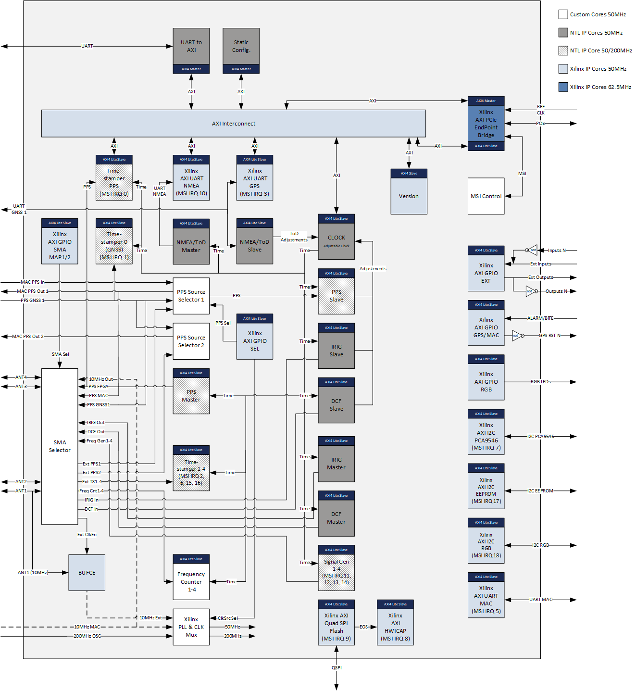

***!! Важный!!***

Эта версия **НЕ** совместима с модулем SOM (например, AC7100B).
Двоичные файлы для временной карты с модулем **System On (SOM)** можно найти здесь:
[Версия SOM](../../../SOM)


# ПЛИС для рабочей версии временной карты


Битовый поток FPGA может быть настроен на различные параметры. В настоящее время он основан на [модуле NetTimeLogic clock module](https://www.nettimelogic.com/clock-products.php). <br />

Проверьте [Readme_Production.pdf](Readme_Production.pdf) для получения более подробной информации о реализации. <br />

В папке [Doc](../../../SOM/FPGA/Doc) находятся все соответствующие документы об интегрированных IP-ядрах (например, описание регистра). <br />

## FPGA запускается со статической конфигурации со следующими настройками: ##
* PPS (including TOD) is used as correction input for the clock  
* PPS Slave Pulse detection on rising edge
* PPS Slave cable delay 0
* TOD Slave UART Baudrate is 115200
* TOD Slave UART polarity default
* TOD Slave in UBX Mode, all GNSS and no messages disabled
* PPS Master polarity rising edge
* PPS Master cable delay 0
* PPS Master pulse width 100 ms
* Clock, PPS Slave, TOD Slave and PPS Master are enabled
* All Timestampers are disabled
* IRIG Slave/Master are disabled
* DCF Slave/Master are disabled
* TOD/NMEA Master is disabled

## В папке Двоичные файлы находятся потоки битов для ПЛИС. ## 
* TimeCardProduction.бит для прошивки ПЛИС (энергозависимый)
* Factory_TimeCardProduction.bin для загрузки SPI flash через JTAG (Золотое изображение + изображение обновления)
* TimeCardProduction.bin для обновления флэш-памяти SPI через SPI, начиная с @ 0x00400000 (только для обновления образа)
 
## Обновление встроенного ПО
```
$ dmesg | grep ptp_ocp | head -1
[ 21.342167] ptp_ocp 0000:11:00.0: устройство включения (0140 -> 0142)
$ cp TimeCardProduction.bin /lib/firmware
$ devlink dev flash pci/0000:11:00.0 файл TimeCardProduction.bin
``