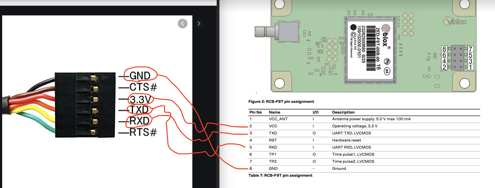

# Конфигурация модуля UBX RCB-F9T GNSS

Пожалуйста, воспользуйтесь конфигуратором UBX U-Center.
Сначала выберите правильный COM-порт и скорость передачи данных 115200 (для стандартных устройств)
Затем в меню Сервис -> Конфигурация приемника... Выберите следующий файл и нажмите "Передать файл" -> "GNSS", пока не будет выбрано "сохранить конфигурацию в BBBR/Flash".
Конфигурация будет выполняться наполовину, пока не начнется сбой.
Измените скорость передачи данных на 4800 и повторите настройку снова. На этот раз настройка будет выполнена полностью. 

## Программирование модуля GNSS

Для программирования модуля GNSS вы можете использовать либо оборудование, входящее в комплект поставки UBX, либо простой кабель FTDI-TTL3v3 (пожалуйста, обратите внимание, что вы должны использовать версию 3v3, а не 5v). Вот простая схема подключения для программирования модуля GNSS.

