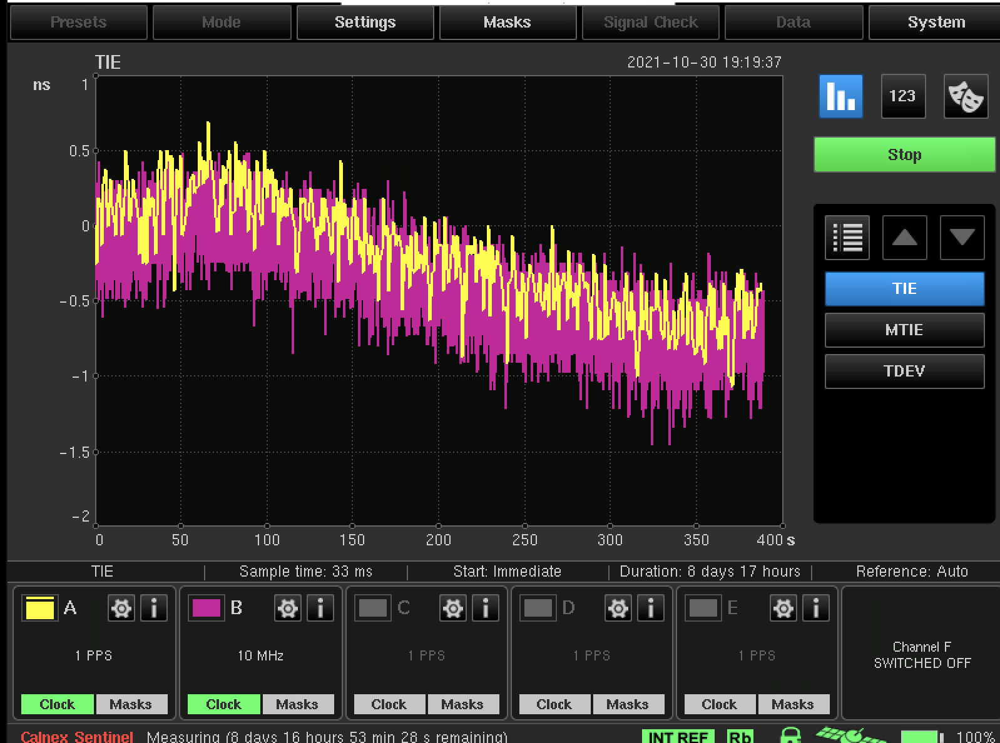

# Qantum Card
#### СПЕЦИФИКАЦИЯ ВЕРСИИ n № 1.0

Эту спецификацию можно получить, используя http://www.qantum.pro  

## Содержание
1. [Общее](#General)
1. [Где купить](#Where-can-I-get-one)
1. [Форм-фактор](#Form-Factor)
1. [GNSS](#GNSS)
   1. [Приемник](#Receiver)
   1. [Безопасность(#Security)
1. [Часы](#Clock)
1. [Мост](#example)
   1. [Hardware реализация](#Hardware-Implementation)
   1. [Software реализация](#Software-Implementation)
1. [Интерфейсы](#Interfaces)
   1. [LED](#LED)
1. [Точность](#Precision)

## Общее
Тайм-сервер - важная часть сети с поддержкой PTP. Он обеспечивает точное время через GNSS, сохраняя точность в случае отказа GNSS с помощью стабильного осциллятора высокой стабильности (и запоминающего состояние), такого как атомные часы. Существующие продукты на рынке часто закрыты и далеки от обладания достаточным набором функций. Проект тайм-карты представляет открытое решение с помощью PCIe-карты, называемой тайм-карта, которая называется Qantum.

## Где купить

Есть три варианта, как получить эту Qantum-карту.

Получить все необходимые исходные коды, спецификации материалов, файлы Gerber и исполняемые файлы для самостоятельной сборки.
Изготавливать Qantum с помощью PCBWay и приобретайте аксессуары для их сборки.
Возможность искать и производить тайм-карты с производителями, которых вы найдете сами.

## Time Card Derivatives
Это тайм-карты, произведенные другими компаниями с использованием разного оборудования, но совместимые с архитектурой и драйвером Qantum-карты:
* [Safran ART2](https://safran-navigation-timing.com/about-the-atomic-reference-time-card-art-card/) (fully open sourced and available on this [link](https://github.com/Orolia2s/art-card-board))
* [ADVA OSA5400](https://urldefense.com/v3/__https://www.oscilloquartz.com/en/products-and-services/embedded-timing-solutions/osa-5400-timecard__;!!Bt8RZUm9aw!74Qc6wh6_yFfgOhGUCr-rX5q6hd1NxC9HwjI7CwVO24C2SXXuzDXk4W3NjlSOZtTBWtvV11UzSicxA$)

## Форм-фактор
Стандартная PCIe-карта вертикального типа
Одноcлотовое исполнение - пассивное охлаждение
 
## GNSS
### Приемник
Приемник GNSS может быть продуктом от ublock или Orient Systems другого производителя, пока он обеспечивает выход PPS и TOD в любом подходящем формате.

Рекомендуемый модуль: модуль времени GNSS u-blox RCB-F9T

### Безопасность
Существуют два основных вектора атак на приемник GNSS:

Подавление
Подавление - самая простая форма атаки. Чтобы продолжить работу во время атаки, наиболее надежным подходом является выполнение долговременного запоминания.
Более подробно о запоминании см. в разделе часы.

Фальсификация
Аутентичность GNSS актуальна сегодня. Желательно наличие механизма защиты от подделки по воздушному каналу.
С использованием специального оборудования можно имитировать констелляцию GNSS и фальсифицировать приемник. Основные принципы защиты от таких атак:

Использование высококачественных приемников GNSS, проверяющих подпись пакета
Реализация дисциплинирования см. более подробно в разделе мост должна защищать от внезапных скачков во времени и пространстве. Для центров обработки данных скачок в пространстве может быть полностью запрещен.  

## Часы
Для правильной работы GNSS требуется "чистое небо". Более того, были случаи кратковременных скачков времени от некоторых констелляций GNSS.
Из-за надежности и в сочетании с обеспокоенностью безопасностью, рекомендуется проводить дополнительное запоминание с помощью высококачественных XO. Примером может быть AC, OCXO, TCXO и т.д.
Для обеспечения устойчивой работы мы рекомендуем использовать AC с запоминанием ± 1 мкс или HQ OCXO с запоминанием ± 22 мкс.

Примеры атомных часов:

SA5X
LN CSAC
mRO-50
SA.45s
DTA-100

Atomic clock examples:
* [SA5X](https://www.microsemi.com/product-directory/embedded-clocks-frequency-references/5570-miniature-atomic-clock-mac-sa5x)
* [LN CSAC](https://www.microsemi.com/product-directory/embedded-clocks-frequency-references/4518-low-noise-csac-ln-csac)
* [mRO-50](https://www.orolia.com/products/atomic-clocks-oscillators/mro-50)
* [SA.45s](https://www.microsemi.com/product-directory/embedded-clocks-frequency-references/5207-space-csac)
* [DTA-100](https://www.taitien.com/wp-content/uploads/2021/10/XO-0191-Low-Power-Atomic-Oscillator-DTA-100-Series.pdf)

   

Figure 2. Atomic Clock Examples

OCXO examples:
* [SiT5711](https://www.sitime.com/products/stratum-3e-ocxos/sit5711)

* [DT-5151](https://www.taitien.com/ti-products/ultra-high-precision-disciplined-oscillator-dt-5151-series)

* ROD2522S2 from Rakon, PPS disciplined oscillator

* Taitien PN: NJ-10M-075 , Stratum 3E oscillator footprint compatible with ROD2522S2

TCXO examples:
* [SiT5356](https://www.sitime.com/products/super-tcxo/sit5356)

* SiT5501 Super-TCXO

* Taitien PN: M0166-T-001-3 , footprint compatible with SiT5501 family

## Мост

The bridge between the GNSS receiver and the Atomic clock can be implemented using software or hardware solutions. The hardware implementation is preferred and is our end goal.

### Аппаратная реализация
Here is one of the examples of hardware implementations.
* FPGA is responsible for most of the functionality
* Exposed /dev/phc and /dev/pps are read by open source software such as ptp4l and chronyd

Figure 3. Time Card Block Diagram

Figure 4. Bridge Block Diagram

### Программная реализация
Программная реализация требует большую часть компонентов, однако связь между ними осуществляется при помощи программного обеспечения пользовательского уровня:

* GPSd отображает /dev/ppsY и предоставляет TOD через SHM
* Плата с FPGA считывает 1 PPS из разных источников
* Хост-демон мониторит смещение и управляет осциллятором
* phc2sys может копировать данные между часами, включая данные между GPSd и атомными, а затем атомные данные на PHC на сетевом интерфейсном контроллере

## Interfaces
* PCIe
    * PCIe x1 (18 pins) generation 1.0 or above on a x4 form-factor
    * Generic, supporting multiple OS versions
    * Exposes PHC device in Linux (/dev/ptpX) as well as PPS (/dev/ppsY)
    * Exposes leap second indicator to a shared memory segment read by chrony/ptp4l
* 1PPS / 10MHz SMA output
* 1PPS / 10MHz SMA input
* IRIG-B input output
* DCF77 input output
* GNSS Antenna SMA input
## Интерфейсы
PCIe
   PCIe x1 (18 пинов) версии 1.0 или выше на форм-факторе x4
   Универсальный, поддерживающий несколько версий ОС
   Отображает устройство PHC в Linux (/dev/ptpX), а также PPS (/dev/ppsY)
   Отображает индикатор второго високосного дня в общем сегменте памяти, считываемом chrony/ptp4l
1PPS / 10МГц SMA выход
1PPS / 10МГц SMA вход
IRIG-B вход/выход
DCF77 вход/выход
Вход SMA для антенны GNSS

### LED

An LED should be used to provide externally visible status information of the time card. 

For example:
* Off - card is not powered or not properly fitted
* Solid green - card is powered, GNSS ok, 1PPS/10MHz output ok
* Flashing green - card is in warm-up, acquiring satellites
* Solid red - alarm / malfunction

# Точность
Временная карта имеет 4 разъема SMA, которые могут быть сконфигурированы как выходы и входы для различных вещей, таких как 10МГц, PHC, MAC, GNSS, GNSS2, IRIG, DCF для выхода и 10МГц, PPS1, PPS2, TS1, TS2, IRIG, DCF для входа.
С использованием устройства Calnex Sentinel происходит сравнение различных вещей. Здесь мы сравниваем выход 1PPS (Канал A) и выход 10МГц (Канал B) от MAC (SA.53).
